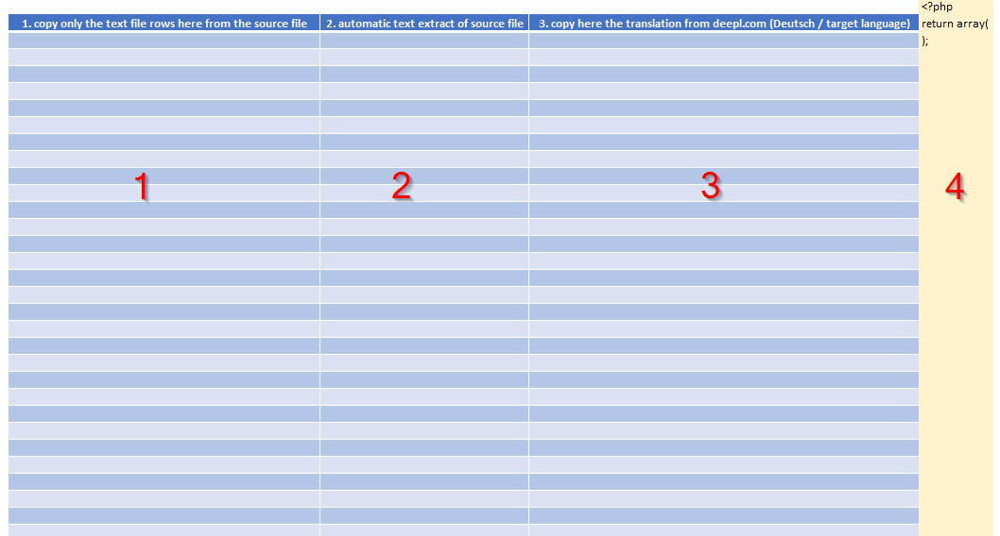
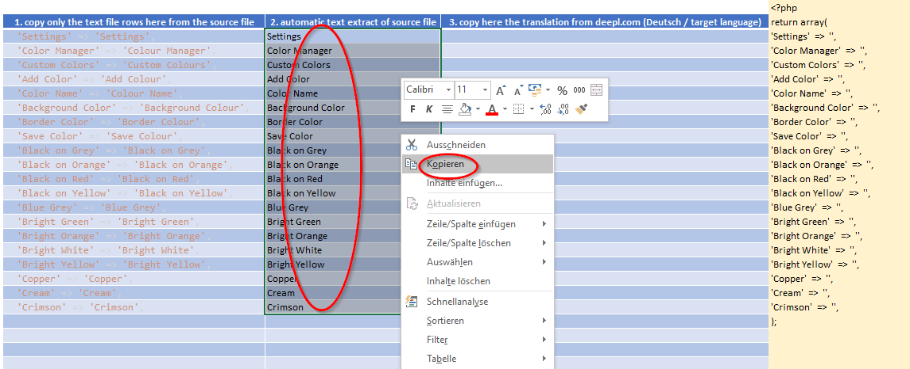
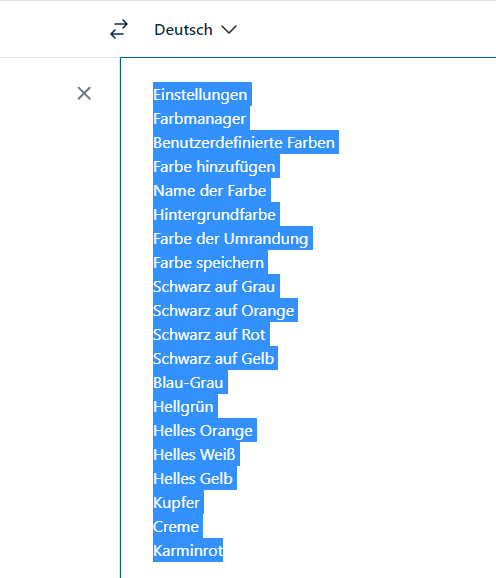
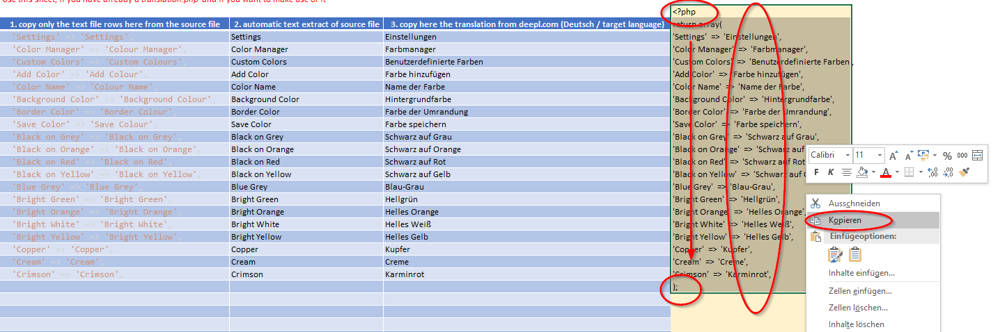
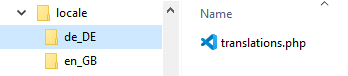

 Use the table of contents

 

**:star: If you use it, you should star it on GitHub!** *It's the least you can do for all the work put into it!*

:de: [Deutsche Fassung dieses Textes](./README_de.md)

PHP Translation Helper (for Kanboard and other projects)
=============================

Welcome to the PHP Translation Helper workbook for the translation of PHP projects that work with translation files. 

Using the Kanboard project as an example, it describes how to create a translation file in no time, e.g. for Kanboard PlugIns.

This Excel workbook supports two approaches.

1. there is a *translations.php* available and one would like to create a new one for another language.
2. you want to create a *translations.php* from scratch.

This documentation describes both approaches.

# Translation based on an existing file

In addition to the Excel workbook, the file with the source language is required also. This file content must be copied into the table in the left column (1) as pure text. Usually you will already find a `translations.php` in the corresponding folder. e.g.:

The sample file contains only the English language and looks like this:

This sample file is located here: [sample file](./example_translations.php)

After opening the Excel workbook, please select the *Fileconverter* sheet first:

The output table for the translation looks (still) like this:

**Column 1**

Here are the lines from *translations.php* that we want to translate.

**Column 2**

Contains formulas, do not enter anything there!

**Column 3**

Contains the translations after you copied them here (s. below)

**Column 4** (colored yellow)

Contains (later) the source code for the new *translations.php* file. Do not make any entries there!

#### 1. Copy the text lines from translations.php to column 1.

When copying, make sure that only blank text is copied. Excessive tabs or spaces do not matter.

Important: Column 1 must not contain any blank lines, comments or other lines. Only the text to be translated in single quotation marks. Preferably in plain text format. In principle, however, a simple copy and paste should work.

For example, if we pasted the text from Visual Studio Code, it looks like this:

In column 1 is the copied text, in column 2 automatically the extracted text to be translated. In column 4 (yellow) we can already see the finished code, but still without translated text.

#### 2. Translating the text with the help of deepl.com

Now the whole(!) text is copied from **column 2**

and will be pasted on [deepl.com](https://deepl.com) into the left box

If the language is not recognized correctly, then this can be selected manually above the left box.

Directly after pasting on the **left side** the translation appears on the right side. This result is now selected and copied:

into our table in **column 3**.

#### 3 . Revise the result of deepl.com and create the file

The result in **column 3** should now be checked again carefully for content. Are the translations linguistically ok? Changes can be made directly in the cells of column 3 without any problems.

The result script in **column 4** will be adjusted dynamically.

If you are satisfied with the translation, open your favorite text editor (or Notepad) and copy the **column 4** from `?php` inclusive to `);`also inclusive.

The result is then saved in the corresponding folder of the project. Example Kanboard for the German translation:

`.\locale\de_DE\translations.php`

That's it.
# Create translation without source file

To do this, please select the table *"From Scratch "*. **There the column 1 is omitted. **

Instead of copying source data from a possibly existing *translations.php*, one enters all texts on the left side (2) oneself and lets these translate then again on https://deepl.com and copies the result into (3), revises this and copies then from (4) the text into an editor of its choice and stores this text then at the correct place.

So in principle it works exactly the same as if you have a file (s. above).

### Contributors

- Fx - Author

- Contributors to this project a very welcome!

