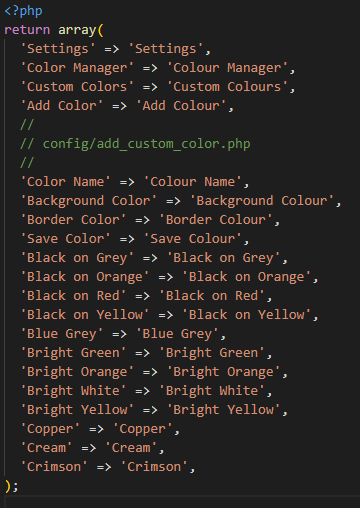

 Use the table of contents

 

**:star: If you use it, you should star it on GitHub!** *It's the least you can do for all the work put into it!*

PHP Translation Helper (für Kanboard und andere Projekte)
=============================

Willkommen zur PHP Translation Helper Mappe für die Übersetzung von PHP Projekten die mit Übersetzungsfiles arbeiten. 

Am Beispiel des Kanboard Projekts wird beschrieben, wie man im Handumdrehen eine Übersetzungsdatei z. B. für Kanboard PlugIns erstellt.

Die Excel Mappe unterstützt zwei Herangehensweisen.

1. Es liegt breites eine *translations.php* vor und man möchte eine für eine andere Sprache erstellen
2. Es soll eine *translations.php* von Grund auf neu erstellt werden

Diese Dokumentation beschreibt beide Vorgehensweisen.

# Übersetzung auf Basis einer vorhandenen Datei

Neben der Excel Mappe wird zunächst die Datei mit der Ausgangssprache benötigt. Diese muss in die Tabelle in der linken Spalte (1) als purer Text einkopiert werden. In der Regel findet man bereits eine `translations.php` im entsprechenden Ordner. z. B.:

Die Beispieldatei enthält nur die englische Sprache und sieht wie folgt aus:

Diese Beispieldatei befindet sich hier: [Beispieldatei](./example_translations.php)

Nach dem Öffnen der Excel Mappe bitte zunächst die Tabelle *Fileconverter* auswählen:

Die Ausgangstabelle für die Übersetzung sieht (noch) so aus:

**Spalte 1**

Hier kommen die Zeilen aus der *translations.php* hinein, die wir übersetzen wollen

**Spalte 2**

Enthält Formeln, dort keine Eingaben vornehmen!

**Spalte 3**

Nimmer später die Übersetzungen auf

**Spalte 4** (gelb eingefärbt)

Enthält (später) den Quellcode für die neue *translations.php* Datei. Dort keine Eingaben vornehmen!

#### 1. Kopieren der Textzeilen aus der translations.php in Spalte 1

Beim Kopieren darauf achten, dass nur blanker Text kopiert wird. Überzählige Tabs oder Leerzeichen spielen keine Rolle.

Wichtig: Spalte 1 darf keine Leerzeilen, Kommentare oder sonstigen Zeilen enthalten. Nur den zu übersetzenden Text in einfachen Hochkommata. Am besten blanken Text. Grundsätzlich sollte aber auch ein einfaches kopieren und einfügen gehen.

Wenn wir z. B. aus Visual Studio Code den Text eingefügt haben sieht das wie folgt aus:

In Spalte 1 ist der einkopierte Text, in Spalte 2 automatisch der Extrahierte Text, der übersetzt werden soll. In Spalte 4 (gelb) sehen wir bereits den fertigen Code, allerdings noch ohne übersetzten Text.

#### 2. Übersetzen des Textes mit Hilfe von deepl.com

Nun wird der gesamte(!) Text aus Spalte 2 kopiert

und bei [deepl.com](https://deepl.com) in der linken Box eingefügt

Wenn die Sprache nicht richtig erkannt wird, dann kann dies über der linken Box oben manuell ausgewählt werden.

Direkt nach dem Einfügen auf der **linken Seite** erscheint die Übersetzung auf der rechten Seite. Dieses Ergebnis wird nun ausgewählt und kopiert:

und dann in unsere Tabelle in **Spalte 3** einkopiert.

#### 3 . Das Ergebnis von deepl.com überarbeiten und die Datei erstellen

Das Ergebnis in **Spalte 3** sollte jetzt noch mal inhaltlich genau geprüft werden. Sind die Übersetzungen sprachlich in Ordnung? Änderungen können in den Zellen der Spalte 3 ohne Probleme direkt vorgenommen werden.

Das Ergebnis-Script in **Spalte 4** wird dynamisch angepasst.

Ist man mit der Übersetzung zufrieden, dann öffnet man seinen Lieblings Texteditor (oder halt Notepad) und kopiert die **Spalte 4** von `?php`(inklusive) bis zum `);`ebenfalls inklusive.

Das Ergebnis speichert man dann im entsprechenden Ordner des Projekts. Beispiel Kanboard für die deutsche Übersetzung:

`.\locale\de_DE\translations.php`

Das wars.
# Übersetzung erstellen ohne Quelldatei

Dazu bitte die Tabelle *"From Scratch"* auswählen. **Dort entfällt die Spalte 1**. 

Statt des Einkopierens von Quelldaten aus einer evtl. vorhandenen *translations.php*, gibt man alle Texte auf der linken Seite (2) selber ein und lässt diese dann wieder auf https://deepl.com übersetzen und kopiert sich dann den Ergebnis Code wieder in (3) hinein, überarbeitet diesen und kopiert dann aus (4) den Text in einen Editor seiner Wahl und speichert diesen Text dann an der richtigen Stelle ab.

Es funktioniert also im Prinzip ganz genau so wie wenn man eine Datei hat.

### Mitwirkende

- Fx - Author

- Unterstützung in diesem Projekt ist willkommen!

